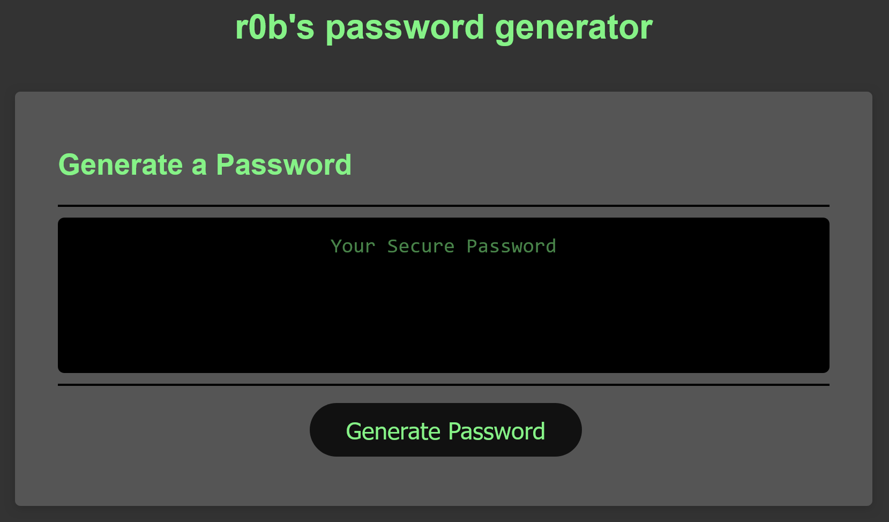

# passworderator

A simple web application that generates passwords.

## Description

Coming up with secure passwords is a pain, so I created a simple applicaiton that generates one from a series of prompts. I learned about an algorithm to randomly shuffle the elements of an array in-place: [The Fisher-Yates shuffle](https://en.wikipedia.org/wiki/Fisher%E2%80%93Yates_shuffle).

## Usage

Navigate to the [deployed application](https://r0b4dams.github.io/passworderator/). Click the generate password button and follow the prompts.

## Technology

- Typescript
- Webpack
- HTML
- CSS
