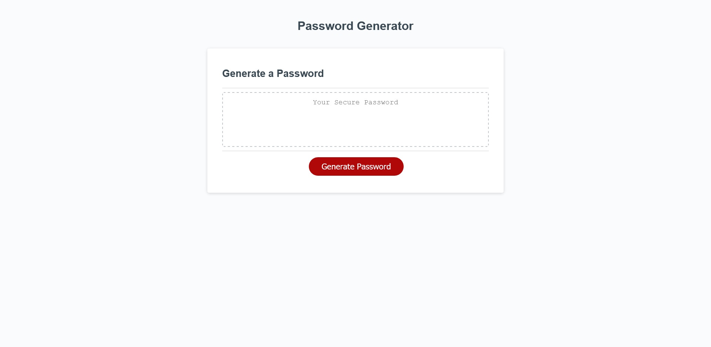

# hw3-password-generator

## Description
This application generates a password. The user is prompted for password length and character types
and the application returns a string of random characters. This project presented an introduction to 
several fundamental programming concepts, including user-defined functions object methods, variable scope, 
conditional statements, and iteration. One interesting challenge was figuring out how to handle edge cases;
the user is directed to enter an integer between 0 and 128, inclusive, but the window.prompt method returns 
user input as a string. Several comparison operators were required to prevent invalid values from being returned
to other methods. The isNaN() method was invaluable in capturing instances were user input could not be cast
as a number.

## Usage

Click on the screenshot to launch the application!

    
## Acknowledgements

Big thank you to these resources:

 - https://www.w3schools.com/jsref/met_win_prompt.asp
 - https://developer.mozilla.org/en-US/docs/Web/API/Window/prompt
 - https://www.w3schools.com/jsref/met_win_alert.asp
 - https://developer.mozilla.org/en-US/docs/Web/API/Window/alert
 - https://www.w3schools.com/js/js_random.asp
 - https://developer.mozilla.org/en-US/docs/Web/JavaScript/Reference/Global_Objects/Math/random
 - https://www.w3schools.com/jsref/met_win_confirm.asp
 - https://developer.mozilla.org/en-US/docs/Web/API/Window/confirm

## License

MIT License

Copyright (c) 2021 Robert Adams

Permission is hereby granted, free of charge, to any person obtaining a copy
of this software and associated documentation files (the "Software"), to deal
in the Software without restriction, including without limitation the rights
to use, copy, modify, merge, publish, distribute, sublicense, and/or sell
copies of the Software, and to permit persons to whom the Software is
furnished to do so, subject to the following conditions:

The above copyright notice and this permission notice shall be included in all
copies or substantial portions of the Software.

THE SOFTWARE IS PROVIDED "AS IS", WITHOUT WARRANTY OF ANY KIND, EXPRESS OR
IMPLIED, INCLUDING BUT NOT LIMITED TO THE WARRANTIES OF MERCHANTABILITY,
FITNESS FOR A PARTICULAR PURPOSE AND NONINFRINGEMENT. IN NO EVENT SHALL THE
AUTHORS OR COPYRIGHT HOLDERS BE LIABLE FOR ANY CLAIM, DAMAGES OR OTHER
LIABILITY, WHETHER IN AN ACTION OF CONTRACT, TORT OR OTHERWISE, ARISING FROM,
OUT OF OR IN CONNECTION WITH THE SOFTWARE OR THE USE OR OTHER DEALINGS IN THE
SOFTWARE.
