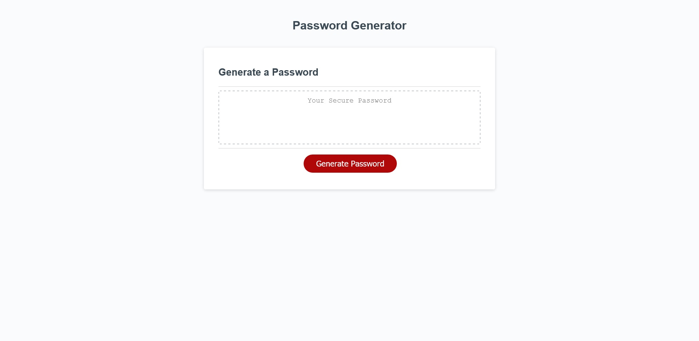

# Password Generator

## Description

This application generates a password. The user is prompted for password length and character types and the application returns a string of random characters. This project presented an introduction to several fundamental programming concepts, including user-defined functions object methods, variable scope, conditional statements, and iteration. One interesting challenge was figuring out how to handle edge cases; the user is directed to enter an integer between 0 and 128, inclusive, but the window.prompt method returns user input as a string. Several comparison operators were required to prevent invalid values from being returned to other methods. The isNaN() method was invaluable in capturing instances were user input could not be cast as a number.

## Table of Contents

- [Installation](#installation)
- [Usage](#usage)
- [Questions](#Questions)
- [License](#License)

## Usage

Click on the screenshot to launch the application!

## Questions

Questions? Reach out to me:

GitHub: [comatosino](https://github.com/comatosino)

Email: adamsiii.robert@gmail.com

## License
    
This project is covered under the [MIT](https://opensource.org/licenses/MIT) license.